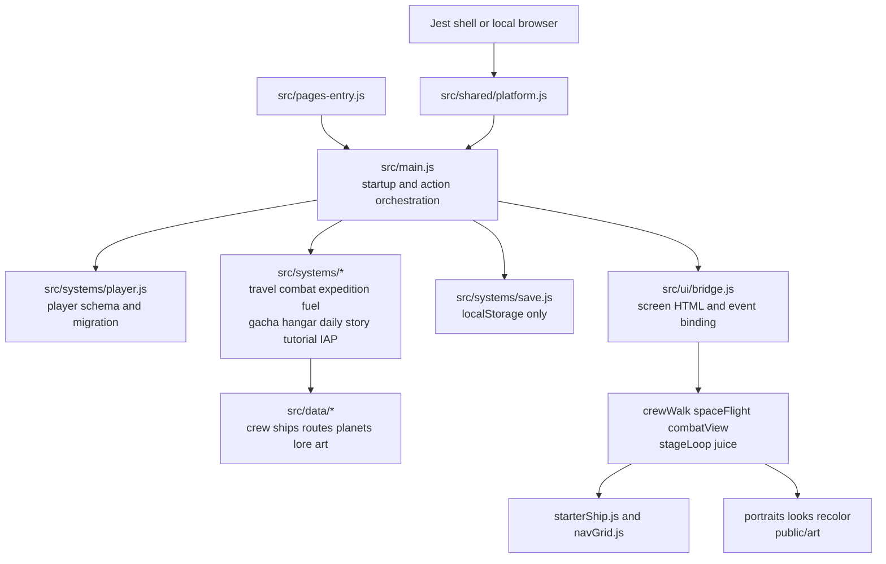

# Warp Crew current architecture

Status: current-state technical reference, not a redesign specification  
Revision inspected: `56693f4a6ea0cb7dce25c670e677d43a56db95e5`  
Audience: designers and engineers extending the current game without discarding working foundations

## Executive summary

Warp Crew is a single-page Vite game with a mutable player model, modular rule systems, data-driven content catalogs, one platform facade, and a mostly centralized HTML renderer/controller. The rule and data modules are the strongest reuse boundary. The greatest implementation risk is the concentration of screen rendering and action orchestration in `src/ui/bridge.js` and `src/main.js`, combined with ship geometry that is split between art, rooms, navigation, and animation assumptions.

The redesign should evolve the existing rules behind explicit contracts. It should not replace the whole game, and it should not add new presentation behavior directly to the existing monolith without first defining the state and interaction boundary it needs.

## System map



## Runtime flow

1. `src/pages-entry.js` loads the shared stylesheet and mounts the game.
2. `src/main.js` initializes the platform facade, loads or creates the player, runs migrations and time-based claims, prepares crew art, and creates the action context passed to the renderer.
3. `src/ui/bridge.js` renders the active screen from the current player and controller context, binds interactions, and attaches the animated stage surfaces.
4. Controller actions call a domain system, mutate the player, write the local save, emit analytics or notifications where wired, and render again.
5. `src/ui/stageLoop.js` drives animation callbacks used by movement, space flight, combat, hit effects, and shake.

## Current boundaries

### Content catalogs

`src/data` holds the authored content and most presentation metadata:

- `crewRoster.js`: mercenary templates, rarity, role, power, biography, quotes, and progression helpers.
- `ships.js`: nine hull definitions, system names, hull costs, and hull progression gates.
- `sectors.js` and `galaxies.js`: travel nodes, encounters, rewards, unlocks, and story beats.
- `planets.js`: expedition destinations and authored metadata.
- `portraits.js`, `looks.js`: art lookup and current crew appearance mapping.
- `starterShip.js`, `navGrid.js`: Sparrow rooms, door points, furniture, walkability, and pathfinding.

The catalogs are broad enough to reuse. Their presentation metadata is not yet sufficient to express distinct alien and robot bodies, room-aligned ship interactions, or a consistent fleet thumbnail system.

### Game rules

`src/systems` owns most deterministic player rules:

- `travel.js` previews and commits route outcomes.
- `combat.js` defines encounters, power, assists, win chance, and result resolution.
- `expedition.js` chooses parties, creates timed jobs, and resolves or skips them.
- `fuel.js`, `economy.js`, and `passives.js` calculate resource changes and modifiers.
- `gacha.js` handles luck, pity, pulls, duplicates, reserve state, contracts, levels, and ranks.
- `hangar.js` handles hull ownership, switching, berths, fuel scaling, and system upgrades.
- `tutorial.js`, `story.js`, and `daily.js` govern guided progression and repeat engagement.
- `iap.js` maps platform products to player grants and incomplete-purchase recovery.

Many of these modules mutate the passed player object. That convention is internally consistent, but each redesigned action needs a clear preview, commit, failure, and telemetry contract so the UI cannot infer rules independently.

### Player state and persistence

`src/systems/player.js` creates and migrates the mutable player object. `src/systems/save.js` serializes it to `localStorage` under the current save key. No live call site persists the player through the platform cloud-data adapter.

Consequences:

- Local refresh persistence exists.
- Cross-device recovery is not implemented.
- Client state cannot be authoritative proof for paid entitlements.
- Schema migration exists, but server reconciliation, conflict handling, and transaction identity do not.

### Platform integration

`src/shared/platform.js` isolates local mocks from the Jest SDK for lifecycle, player identity, registration, events, data, notifications, products, purchase start/completion, and incomplete purchases. This is a good seam to preserve.

Known gaps are documented in [Jest platform and monetization research](research/2026-09-21-jest-platform-monetization.md). The adapter does not currently provide subscription entitlements, a trusted purchase-verification call, or first-meaningful-milestone signaling.

### Presentation and input

`src/ui/bridge.js` builds the principal screens and binds most player actions. `src/main.js` supplies a large controller context. This arrangement allowed the prototype to grow quickly but makes phone hierarchy, input behavior, and transactional feedback harder to change independently.

A safe evolution path is to extract one surface at a time behind a stable view-model and action contract. The first extraction should be the ship home because it must unify visible rooms, hit regions, path targets, labels, camera focus, and crew destinations.

### Ship geometry and movement

`src/data/starterShip.js` defines four coarse rooms against a 1152 by 1728 hull coordinate space. `src/data/navGrid.js` converts room, furniture, hallway, and door information into a 72 by 128 path grid. `src/ui/crewWalk.js` maintains actors, chooses destinations, runs paths, picks animation direction, and draws crew.

The four-direction sheet contract is already explicit in `src/ui/crewArt.js`:

- direction rows: down, left, right, up;
- four frames per direction;
- 96 by 96 source cells.

The current rendering shrinks full cells too aggressively and adds a separate sinusoidal vertical offset. A replacement must preserve direction/path behavior while introducing authored crop, foot anchor, draw scale, and body-family metadata. Movement must not synthesize vertical bobbing on top of the actual frames.

## Authority and trust model

| State | Current owner | Current durability | Suitable for launch authority? |
|---|---|---:|---|
| Credits, gems, fuel, hulls, crew | Browser player object | Local save | No for paid value |
| Purchase completion token | Platform plus local dedupe list | Local save | No |
| Signed purchase payload | Returned by platform | Not verified or retained authoritatively | No |
| Guest or registered identity | Jest platform | Platform | Identity only |
| Notifications | Jest scheduling API | Platform scheduled | Yes, subject to lifecycle correctness |
| Content definitions | Bundled JavaScript | Build artifact | Yes for static definitions |
| Analytics events | Jest event API | Platform telemetry | Yes for observation, not economy authority |

## Test topology

The repository uses direct Node assertion scripts rather than a test runner:

- focused rule tests cover timers, fuel, economy, daily login, travel, and platform/IAP mocks;
- phase tests cover earlier feature expectations;
- `test/sanity.mjs` provides the broadest current invariant coverage across content, progression, tutorial, combat, expeditions, ships, gacha, and IAP grants.

The default `npm test` chain stops at the first failing script. At the inspected revision, two historical expectations conflict with newer behavior. Both need a product-rule decision and then reconciliation; they must not simply be weakened until green.

## Safe change sequence

1. Approve player promise, fairness boundary, and daily-loop design.
2. Define view-model and action contracts for the ship home and first-session loop.
3. Create tests for the approved behavior before altering the implementation.
4. Replace coarse ship geometry with one authored manifest shared by input and movement.
5. Correct sprite crops, anchors, scale, and body families while preserving directional semantics.
6. Extract and rebuild one phone surface at a time.
7. Introduce economy simulation before adding offers or expanding prices.
8. Establish save and purchase authority before enabling meaningful paid progression.
9. Verify automated rules, rendered states, touch geometry, safe areas, and real-device performance.

## Local verification commands

```sh
npm run build
node test/sanity.mjs
npm test
```

Interpret each result against its actual coverage. A passing build proves bundling, not phone usability; the sanity script proves only the encoded invariants; and the chained suite can contain obsolete product expectations.

