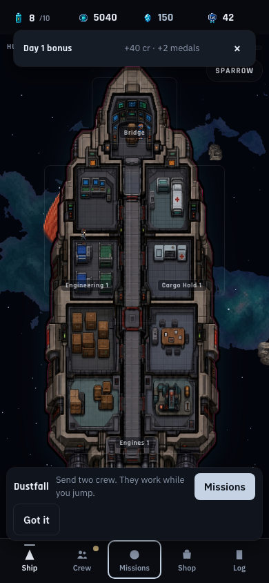
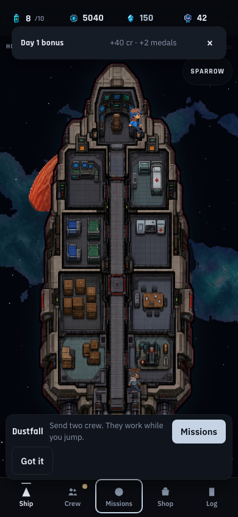
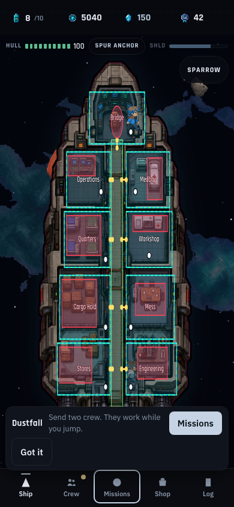
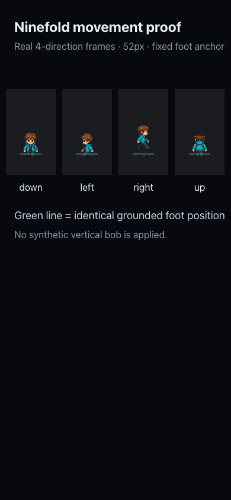

# Ship and animation foundation QA

Status: package PASS with remaining real-device gates
Baseline code: `56693f4a6ea0cb7dce25c670e677d43a56db95e5`  
Approved documentation commit: `4e34e2e`  
Implementation commits inspected: `a3aa7b5`, `c4b2613`, `1295fe8`, `4b5e8ef`, `8bb3eea`, `dc1cad1`, `d268cb5`  
Viewport evidence: 390 by 844 CSS pixels, Chrome device scale factor 1

## Verdict

The package meets its desktop-emulated phone acceptance criteria. The ship now has nine visual compartments with matching input ownership; room-to-room movement is fully connected through authored doors and the central spine; characters use cropped Ninefold frames at a readable 52px height; and the actor's path coordinate remains the stable foot position without synthetic vertical bobbing.

This is not production-release approval. Real iPhone and Android touch, safe-area, performance, and reduced-motion checks remain required before release.

## Automated evidence

### Focused ship suite — PASS

Command: `npm run test:ship`

- `ship_layout.test.mjs`: PASS
- `ship_pathing.test.mjs`: PASS
- `crew_animation.test.mjs`: PASS
- `ship_view.test.mjs`: PASS
- `ship_debug.test.mjs`: PASS

Coverage includes:

- nine unique rooms and resolved room doors;
- exact corridor non-selection;
- all 81 ordered room-to-room paths contain only walkable points;
- authored room exit, spine, and room entry waypoints;
- all four direction rows and four-frame wrapping;
- source crops remain inside the 384 by 384 sheet;
- 52px placement retains an invariant foot anchor;
- idle, working, and walking pose geometry share the same ground point;
- development overlay is disabled in production mode;
- room markup exposes selected, alert, polygon, and accessible states.

### Broad content sanity — PASS

Command: `node test/sanity.mjs`

Result: `OK crew 46 nodes 51 planets 34 visits 1 beats 30 map 7 exp 3 enc 16`

### Production build — PASS

Command: `npm run build`

Result:

- 45 modules transformed;
- CSS 25.40 kB before gzip;
- JavaScript 206.29 kB before gzip, 66.48 kB gzip;
- build completed successfully.

### Default chained suite — PASS

Command: `npm test`

All chained scripts pass: timer, fuel, economy, daily, travel, platform/IAP, Phase C progression, tutorial/week progression, and the broad sanity harness.

The two stale baseline expectations were reconciled without relaxing the current rules:

- the Phase C test now earns the chapter, reputation, and prerequisite-hull gates before purchasing the Corvette;
- the tutorial test now verifies that the third berth unlocks after the scripted first combat, records the current `recruited` event, and completes the tutorial before asserting post-tutorial week progression.

## Phone interaction evidence

A Chrome DevTools Protocol harness set the actual viewport to 390 by 844, seeded the player through `createNewPlayer()` and `completeTutorial()`, and exercised the live application.

Verified:

1. Every room center resolves to its own clipped hotspot: Bridge, Operations, Medbay, Quarters, Workshop, Cargo Hold, Mess, Stores, and Engineering.
2. A central-spine point resolves to no room.
3. An exterior-hull point resolves to no room.
4. Tapping each room center selects that exact room.
5. Every selected-room button has a measured height of at least 44px.
6. HUD chips measure 44px high.
7. Bottom compartments place their room sheet above the ship; upper compartments place it below. The selected room is not vertically obscured.
8. Development geometry is present only with `?shipDebug=1`.

## Visual comparison

### Before

The baseline combines multiple visible compartments into four large rectangles. A full 96px source cell is shrunk to a 20–26px destination, leaving the character itself roughly half that visible height. Persistent labels and the tutorial card compete with the ship.

### After

The runtime view now shows 52px cropped crew anchored at their feet. Persistent room labels are absent until selection, alert, or keyboard focus. The later tutorial package still owns the large bottom coach card.

### Geometry overlay

Overlay legend:

- cyan: room hit polygons;
- green: walk bounds and central spine;
- yellow: door connections;
- red: furniture blockers;
- white: work anchors;
- orange: thruster effect anchors.

### Four-direction frame proof

The proof uses the shipped `walk-4dir.png` plus the production `walkFrameSource()` and `walkFrameDestination()` helpers at the 52px runtime height. All four directions share the same foot line. No synthetic bob offset is applied.

## Remaining gates

1. Run the package on at least one real iPhone and one real Android device.
2. Test every shared room boundary with physical touch, not only center-point automation.
3. Measure art preparation, canvas frame time, memory, and thermal behavior with a larger aboard crew.
4. Exercise OS-level reduced motion; its policy is automated, but the actual media-query transition was not captured.
5. Calibrate room polygons if real-device taps reveal edge ambiguity.
6. Add distinct alien, droid, broad, small, and exceptional body-family art; this package creates the profile seam but deliberately retains the current fallback art.
7. Remove or redesign the daily/tutorial cards in their owning package; they still obscure substantial screen space.
8. Reconcile the two historical default-suite expectations in their owning progression and tutorial packages.
